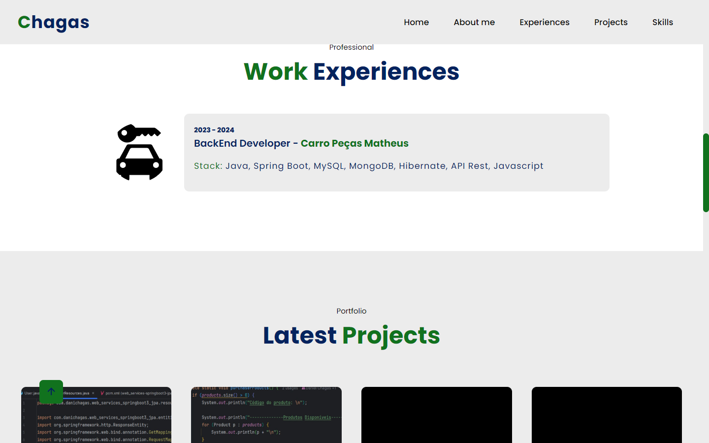

# Portfolio S3 - Update🍃
I made a huge update to my portfolio, below I will mention one of the changes I made.
 

## Cleaner portfolio :
I changed the fonts on the site, making the user experience more pleasant.

## Changed colors :
I changed the colors to green to give a more professional look.

## Website images :

    
    
    

 

## Mobile :

    
    
    

